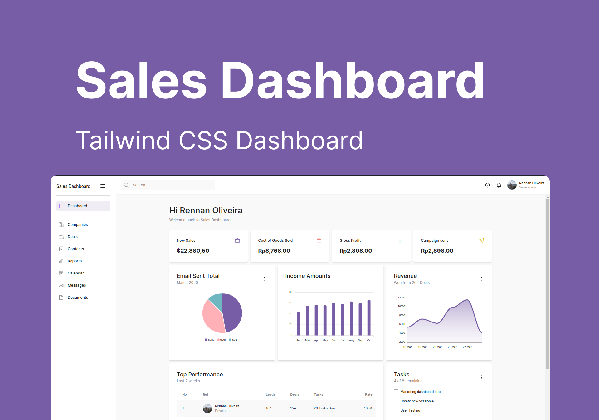

<p align="center">
  
</p>

<p align="center">
  <a href="#-tecnologias">Tecnologias</a>&nbsp;&nbsp;&nbsp;|&nbsp;&nbsp;&nbsp;
  <a href="#-projeto">Projeto</a>&nbsp;&nbsp;&nbsp;|&nbsp;&nbsp;&nbsp;
  <a href="#memo-licença">Licença</a>
</p>

<p align="center">
 
  
  

  
</p>


## 📝 Descrição

A aplicação Sales Dashboard foi desenvolvida com o intuito de treinar novas ferramentas frontend e a ferramenta escolhida para essa aplicação foi o [Tailwind CSS](https://tailwindcss.com/) e está me ajudando a ter muita produtividade na criação da interface da aplicação.

## ⚡️ Iniciando o Projeto

### Clonando Projeto
```bash
git clone https://github.com/RennanD/sales-dashboard.git
```

### Requisitos

* [Node](https://nodejs.org/en/)
* [Yarn](https://classic.yarnpkg.com/lang/en/docs/install/#debian-stable) (Opicional)

### Instalando Dependências  
* Utilizando NPM 
```bash
npm install
```

* Utilizando Yarn 
```bash
yarn
```

### Iniciando Projeto  
* Utilizando NPM 
```bash
npm run dev
```

* Utilizando Yarn 
```bash
yarn dev
```

## 🚀 Tecnologias

- [ReactJs](https://pt-br.reactjs.org/)
- [Vite](https://vitejs.dev/)
- [Tailwind CSS](https://tailwindcss.com/)

## 🚧 Projeto

Live Preview: https://sales-dashboard.pages.dev/

## :memo: Licença

Esse projeto está sob a licença MIT. Veja o arquivo [LICENSE](LICENSE) para mais detalhes.

---

Feito com ♥ by rennand
